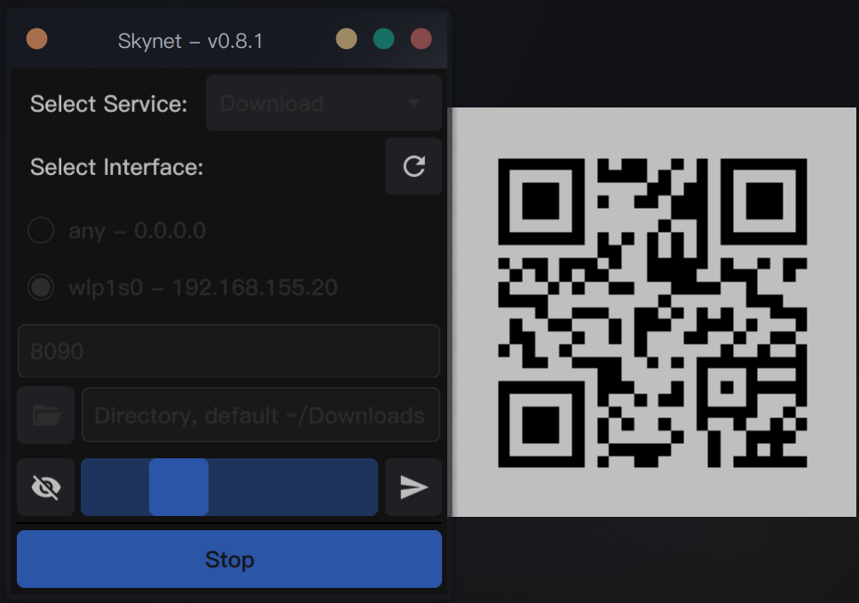

<h1 align="center">Skynet</h1>
<h3 align="center">一个网络服务管理器</h3>

<!-- File: README.md -->
<!-- Author: YJ -->
<!-- Email: yj1516268@outlook.com -->
<!-- Created Time: 2023-10-27 14:44:26 -->

---

<p align="center">
  <a href="https://github.com/YHYJ/skynet/actions/workflows/release.yml"></a>
</p>

---

## Table of Contents

<!-- vim-markdown-toc GFM -->

* [适配](#适配)
* [安装](#安装)
  * [一键安装](#一键安装)
  * [编译安装](#编译安装)
    * [当前平台](#当前平台)
    * [交叉编译](#交叉编译)
* [用法](#用法)
* [截图](#截图)
  * [CLI 版](#cli-版)
  * [GUI 版](#gui-版)

<!-- vim-markdown-toc -->

---

<!------------------------------------->
<!--      _                     _    -->
<!--  ___| | ___   _ _ __   ___| |_  -->
<!-- / __| |/ / | | | '_ \ / _ \ __| -->
<!-- \__ \   <| |_| | | | |  __/ |_  -->
<!-- |___/_|\_\\__, |_| |_|\___|\__| -->
<!--           |___/                 -->
<!------------------------------------->

---

## 适配

- Linux: 适配
- macOS: 适配
- Windows: 适配

## 安装

### 一键安装

```bash
curl -fsSL https://raw.githubusercontent.com/YHYJ/skynet/main/install.sh | sudo bash -s
```

也可以从 [GitHub Releases](https://github.com/YHYJ/skynet/releases) 下载解压后使用

### 编译安装

#### 当前平台

如果要为当前平台编译，可以使用以下命令：

```bash
go build -gcflags="-trimpath" -ldflags="-s -w -X github.com/yhyj/skynet/general.GitCommitHash=`git rev-parse HEAD` -X github.com/yhyj/skynet/general.BuildTime=`date +%s` -X github.com/yhyj/skynet/general.BuildBy=$USER" -o build/skynet main.go
```

**如果是 Linux 平台，可以添加 -tags "flatpak" 参数添加对 XDG Desktop Portals 的支持**

#### 交叉编译

> 使用命令`go tool dist list`查看支持的平台
>
> Linux 和 macOS 使用命令`uname -m`，Windows 使用命令`echo %PROCESSOR_ARCHITECTURE%` 确认系统架构
>
> - 例如 x86_64 则设 GOARCH=amd64
> - 例如 aarch64 则设 GOARCH=arm64
> - ...

设置如下系统变量后使用 [编译安装](#编译安装) 的命令即可进行交叉编译：

- CGO_ENABLED: 使用 CGO，设为 1
- GOOS: 设为 linux, darwin 或 windows
- GOARCH: 根据当前系统架构设置

## 用法

- `gui`子命令

  启动 GUI 版 Skynet

- `http`子命令

  在 CLI 启动 HTTP 服务

- `version`子命令

  查看程序版本信息

- `help`

  查看程序帮助信息

## 截图

### CLI 版


### GUI 版



- 'Select Service': 选择服务模式，可选值为下载服务'Download'、上传服务'Upload'和上传/下载服务都开启的'All'
- 'Select Interface': 选择网络接口，服务在选择的接口上启动。右侧是刷新接口列表的按钮
- 'Port': 端口设置框，服务绑定到指定的端口
- 'Directory': 服务路径设置，选定的服务在此路径上启动。左侧是打开路径选择器'Direcctory Selection'的按钮
- '状态栏': 蓝色无文字的是状态栏，代表了服务的运行状态。其左侧是二维码的显示/隐藏按钮，右侧是在默认浏览器打开服务地址的按钮
- 'Start/Stop 按钮': 服务的启动/停止按钮，服务未启动显示'Start'，服务启动后显示'Stop'
